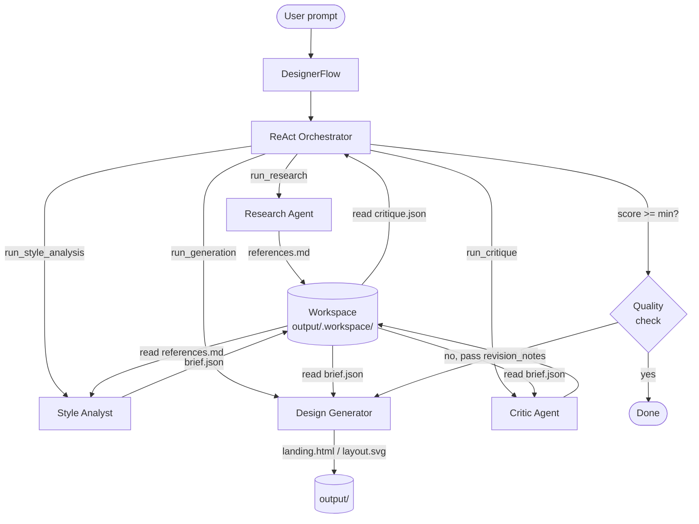

# AI Designer — CrewAI Flow

A multi-agent design system built on **CrewAI Flow 1.10+**.
Agents operate through a typed `FlowState`; steps are wired together with `@start` / `@listen` / `@router`.

## Pipeline



## Flow Architecture

```
@start  research()         — Research Agent (Firecrawl + WebSearch)
          │
@listen analyze_style()    — Style Analyst → DesignBrief (JSON)
          │
@listen generate()         — Design Generator → file in output/
          │
@listen critique()         — Critic Agent → CritiqueResult (JSON)
          │
@router check_quality()    ──→ "done"     (score ≥ MIN_SCORE)
                           └──→ "generate" (iterate, score < MIN_SCORE)
          │
@listen done()             — final output
```

All shared state lives in `DesignerState(FlowState)`. Each step reads and writes
`self.state` directly. There are no `context=[]` lists between tasks — data is
passed through files in `output/.workspace/`.

## Installation

```bash
python -m venv .venv && source .venv/bin/activate
pip install -r requirements.txt
cp .env.example .env   # fill in your API keys
```

`.env`:
```
ANTHROPIC_API_KEY=sk-ant-...
FIRECRAWL_API_KEY=fc-...
MIN_QUALITY_SCORE=7.0
OUTPUT_DIR=./output
```

## Usage

```bash
python main.py "landing page for an architecture studio"
python main.py "brand identity for a restaurant" --format brandbook
python main.py "website for a photographer" --format moodboard
python main.py "premium jewelry brand" --format html --min-score 8
```

## Output Formats

| Flag | File | Description |
|------|------|-------------|
| `html` | `landing.html` | Full single-page landing |
| `svg` | `layout.svg` | Visual layout 1440×900px |
| `moodboard` | `moodboard.html` | References, palette, typography |
| `brandbook` | `brandbook.html` | Logo, colors, fonts, usage examples |

## Project Structure

```
ai-designer/
├── main.py               # CLI (click)
├── flow.py               # DesignerFlow — full pipeline
├── agents/
│   └── builders.py       # Agent and task factories
├── tools/
│   └── design_tools.py   # Firecrawl, WebSearch, FileWriter
├── models/
│   └── state.py          # DesignerState(FlowState), DesignBrief, CritiqueResult
└── output/               # Generated results
```

## Adding a New Format

1. `models/state.py` — add a value to `OutputFormat`
2. `agents/builders.py` — add instructions to `_FORMAT_INSTRUCTIONS`
3. `main.py` — add to `click.Choice`
