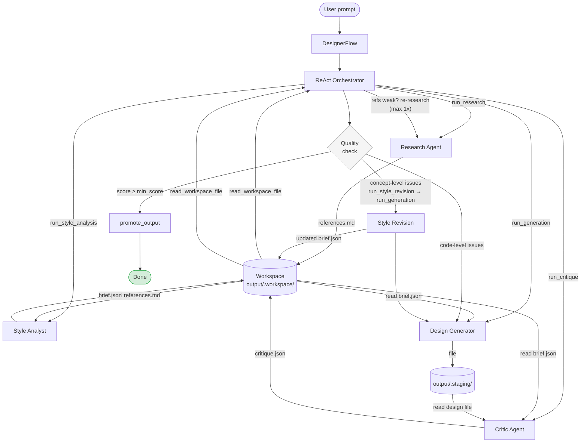

# AI Designer — CrewAI Flow

A multi-agent design system built on **CrewAI Flow 1.10+**.
Agents operate through a typed `FlowState`; steps are wired together with `@start` / `@listen` / `@router`.

## Pipeline



> Generation iterates until `overall_score ≥ min_quality_score` or the hard `max_generation_iter` limit is reached.
> Files reach `output/` only after passing the quality check via `promote_output`.

## Flow Architecture

```
@start  research()         — Research Agent (Firecrawl + WebSearch)
          │
@listen analyze_style()    — Style Analyst → DesignBrief → brief.json
          │
@listen generate()         — Design Generator → file in output/.staging/
          │
@listen critique()         — Critic Agent → CritiqueResult → critique.json
          │
@router check_quality()    ──→ "done"      (score ≥ MIN_SCORE or iter limit reached)
                           └──→ "generate"  (iterate, score < MIN_SCORE)
          │
@listen done()             — promote staging → output/, final output
```

Data between agents is passed through files in `output/.workspace/`.
Generated files live in `output/.staging/` until promoted after passing quality check.

## What was improved

| Area | Before | After |
|------|--------|-------|
| **Infinite loop protection** | No limit on generation iterations — Critic could cycle forever | Hard limit via `_generation_counter` in code + `check_quality()` guard in flow; termination reason logged (`quality_passed` / `max_iterations`) |
| **Revision routing** | All revision notes went to Generator regardless of issue type | Orchestrator classifies critique: code-level → Generator, concept-level → Style Analyst updates `brief.json` first, then Generator reads the new brief |
| **Re-research path** | Research ran once; weak references silently produced weak briefs | Orchestrator explicitly evaluates references after research and can re-run `run_research` with a refined query (max 1 re-research) |
| **Output integrity** | Every generation overwrote `output/` directly; last iteration = final file even if it was worse | Generator writes to `output/.staging/`; file reaches `output/` only after `promote_output` — quality check is a hard gate |
| **Settings** | `os.getenv` hardcoded throughout | All config in `config/settings.py` (pydantic-settings, env-overridable) |
| **Observability** | Silent failures, no structured logging | `logging` throughout; `termination_reason` in state; `logger.warning` on limit hit |
| **Reliability** | Single LLM call failure crashed the pipeline | `_run_crew_with_retry` wraps every crew call with exponential backoff |
| **Prompt management** | Task descriptions inline in Python strings | Extracted to `prompts/*.txt`, loaded at runtime — editable without touching code |

## Installation

```bash
python -m venv .venv && source .venv/bin/activate
pip install -r requirements.txt
cp .env.example .env   # fill in your API keys
```

`.env`:
```
ANTHROPIC_API_KEY=sk-ant-...
FIRECRAWL_API_KEY=fc-...
MIN_QUALITY_SCORE=7.0
OUTPUT_DIR=./output
MAX_GENERATION_ITER=3
```

## Usage

```bash
python main.py "landing page for an architecture studio"
python main.py "brand identity for a restaurant" --format brandbook
python main.py "website for a photographer" --format moodboard
python main.py "premium jewelry brand" --format html --min-score 8
```

## Output Formats

| Flag | File | Description |
|------|------|-------------|
| `html` | `landing.html` | Full single-page landing |
| `svg` | `layout.svg` | Visual layout 1440×900px |
| `moodboard` | `moodboard.html` | References, palette, typography |
| `brandbook` | `brandbook.html` | Logo, colors, fonts, usage examples |

## Project Structure

```
ai-designer/
├── main.py                    # CLI (click)
├── flow.py                    # DesignerFlow — full pipeline
├── agents/
│   ├── builders.py            # Agent and task factories
│   └── orchestrator.py        # ReAct orchestrator agent
├── tools/
│   ├── design_tools.py        # Firecrawl, WebSearch, FileWriter (→ staging)
│   ├── workspace.py           # Workspace + staging helpers
│   └── orchestrator_tools.py  # Run*Tool, PromoteOutputTool
├── prompts/                   # Agent task descriptions (plain text)
├── models/
│   └── state.py               # DesignerState, DesignBrief, CritiqueResult
├── config/
│   ├── settings.py            # Pydantic settings (env-overridable)
│   └── logging_config.py
├── tests/
│   └── test_tools.py          # Unit tests (no API calls)
└── output/
    ├── .workspace/            # Intermediate files (references, brief, critique)
    └── .staging/              # Pre-promotion generated files
```

## Adding a New Format

1. `models/state.py` — add a value to `OutputFormat`
2. `agents/builders.py` — add instructions to `_FORMAT_INSTRUCTIONS`
3. `main.py` — add to `click.Choice`
